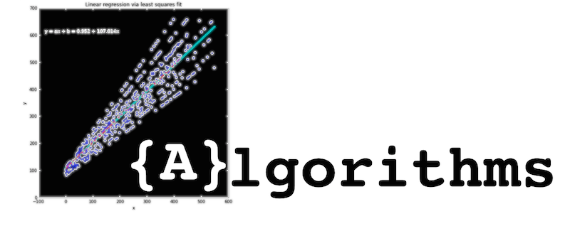

#### About this repository

This repository is meant to be a growing collection of interesting and useful algorithms implemented in Python and presented in IPython notebooks. IPython notebooks, because they offer a convenient way for describing the algorithm, benchmarking, maybe even visualization, and eventually sharing and viewing.

#### I am looking forward to your contributions, suggestions, and ideas

If you have any suggestions or want to make additions, I would be very happy if you could send me  
- an [email](mailto:se.raschka@gmail.com),  
- leave me a message on [google+](https://plus.google.com/118404394130788869227/),  
- or even send me a tweet on [twitter](https://twitter.com/rasbt) (given you can fit it within the 140 character limit ;)).  
- Or even better: It would be great if you would simply fork this project and send me a pull request.

 
 

# Categories

### Algorithm Essentials

#### Greedy Algorithms

- Introduction to Greedy Algorithms [[ GitHub ](ipython_nbs/essentials/greedy-algorithm-intro.ipynb)] [[ Jupyter nbviewer ](http://nbviewer.ipython.org/github/rasbt/algorithms_in_ipython_notebooks/blob/master/ipython_nbs/essentials/greedy-algorithm-intro.ipynb)]
- More Greedy Algorithm Examples [[ GitHub ](ipython_nbs/essentials/greedy-algorithm-examples.ipynb)] [[ Jupyter nbviewer ](http://nbviewer.ipython.org/github/rasbt/algorithms_in_ipython_notebooks/blob/master/ipython_nbs/essentials/greedy-algorithm-examples.ipynb)]
- Breadth-First Search [cross-linked] [[ GitHub ](ipython_nbs/search/breadth-first-search.ipynb)] [[ Jupyter nbviewer ](http://nbviewer.ipython.org/github/rasbt/algorithms_in_ipython_notebooks/blob/master/ipython_nbs/search/breadth-first-search)] 
- Dijkstra's Algorithm [cross-linked] [[ GitHub ](ipython_nbs/search/dijkstra-algorithm.ipynb)] [[ Jupyter nbviewer ](http://nbviewer.ipython.org/github/rasbt/algorithms_in_ipython_notebooks/blob/master/ipython_nbs/search/dijkstra-algorithm.ipynb)] 

#### Divide-and-Conquer Algorithms

- Introduction to Divide-and-Conquer Algorithms[[ GitHub ](ipython_nbs/essentials/divide-and-conquer-algorithm-intro.ipynb)] [[ Jupyter nbviewer ](http://nbviewer.ipython.org/github/rasbt/algorithms_in_ipython_notebooks/blob/master/ipython_nbs/essentials/divide-and-conquer-algorithm-intro.ipynb)]
- Binary Search [cross-linked] [[ GitHub ](ipython_nbs/search/binary_search.ipynb)] [[ Jupyter nbviewer ](http://nbviewer.ipython.org/github/rasbt/algorithms_in_ipython_notebooks/blob/master/ipython_nbs/search/binary_search.ipynb)] 
- Recursion Examples [[ GitHub ](ipython_nbs/essentials/recursion-examples.ipynb)] [[ Jupyter nbviewer ](http://nbviewer.ipython.org/github/rasbt/algorithms_in_ipython_notebooks/blob/master/ipython_nbs/essentials/recursion-examples.ipynb)]

#### Other

- FizzBuzz [[ GitHub ](ipython_nbs/essentials/fizzbuzz.ipynb)] [[ Jupyter nbviewer ](http://nbviewer.ipython.org/github/rasbt/algorithms_in_ipython_notebooks/blob/master/ipython_nbs/essentials/fizzbuzz.ipynb)]

### Sorting Algorithms

- Selection Sort [[ GitHub ](ipython_nbs/sorting/selection_sort.ipynb)] [[ Jupyter nbviewer ](http://nbviewer.ipython.org/github/rasbt/algorithms_in_ipython_notebooks/blob/master/ipython_nbs/sorting/selection_sort.ipynb)]
- Bubble Sort [[ GitHub ](ipython_nbs/sorting/bubble_sort.ipynb)] [[ Jupyter nbviewer ](http://nbviewer.ipython.org/github/rasbt/algorithms_in_ipython_notebooks/blob/master/ipython_nbs/sorting/bubble_sort.ipynb)]
- QuickSort [[ GitHub ](ipython_nbs/sorting/quicksort.ipynb)] [[ Jupyter nbviewer ](http://nbviewer.ipython.org/github/rasbt/algorithms_in_ipython_notebooks/blob/master/ipython_nbs/sorting/quicksort.ipynb)]

### Data Structures

- Implementing a Simple Hash Table [[ GitHub ](ipython_nbs/data-structures/hashtable-1.ipynb)] [[ Jupyter nbviewer ](http://nbviewer.ipython.org/github/rasbt/algorithms_in_ipython_notebooks/blob/master/ipython_nbs/data-structures/hashtable-1.ipynb)] 
- Bloom Filters [[ GitHub ](ipython_nbs/data-structures/bloom-filter.ipynb)] [[ Jupyter nbviewer ](http://nbviewer.ipython.org/github/rasbt/algorithms_in_ipython_notebooks/blob/master/ipython_nbs/data-structures/bloom-filter.ipynb)] 
- Singly Linked List [[ GitHub ](ipython_nbs/data-structures/singly-linked-list.ipynb)] [[ Jupyter nbviewer ](http://nbviewer.ipython.org/github/rasbt/algorithms_in_ipython_notebooks/blob/master/ipython_nbs/data-structures/singly-linked-list.ipynb)]
- Stacks [[ GitHub ](ipython_nbs/data-structures/stacks.ipynb)] [[ Jupyter nbviewer ](http://nbviewer.ipython.org/github/rasbt/algorithms_in_ipython_notebooks/blob/master/ipython_nbs/data-structures/stacks.ipynb)]
- Queues and Deques [[ GitHub ](ipython_nbs/data-structures/queues-and-deques.ipynb)] [[ Jupyter nbviewer ](http://nbviewer.ipython.org/github/rasbt/algorithms_in_ipython_notebooks/blob/master/ipython_nbs/data-structures/queues-and-deques.ipynb)]

### Search Algorithms

- Binary Search [[ GitHub ](ipython_nbs/search/binary_search.ipynb)] [[ Jupyter nbviewer ](http://nbviewer.ipython.org/github/rasbt/algorithms_in_ipython_notebooks/blob/master/ipython_nbs/search/binary_search.ipynb)] 
- Breadth-First Search [[ GitHub ](ipython_nbs/search/breadth-first-search.ipynb)] [[ Jupyter nbviewer ](http://nbviewer.ipython.org/github/rasbt/algorithms_in_ipython_notebooks/blob/master/ipython_nbs/search/breadth-first-search)] 
- Dijkstra's Algorithm [[ GitHub ](ipython_nbs/search/dijkstra-algorithm.ipynb)] [[ Jupyter nbviewer ](http://nbviewer.ipython.org/github/rasbt/algorithms_in_ipython_notebooks/blob/master/ipython_nbs/search/dijkstra-algorithm.ipynb)] 

### Statistical Analysis

- Linear regression via the least squares fit method [[ GitHub ](ipython_nbs/statistics/linregr_least_squares_fit.ipynb)] [[ Jupyter nbviewer ](http://nbviewer.ipython.org/github/rasbt/algorithms_in_ipython_notebooks/blob/master/ipython_nbs/statistics/linregr_least_squares_fit.ipynb)]
- Dixon's Q test to identify outliers for small sample sizes [[ GitHub ](ipython_nbs/statistics/dixon_q_test.ipynb)] [[ Jupyter nbviewer ](http://nbviewer.ipython.org/github/rasbt/algorithms_in_ipython_notebooks/blob/master/ipython_nbs/statistics/dixon_q_test.ipynb)]
- Rejection sampling [[ GitHub ](ipython_nbs/data-structures/rejection_sampling.ipynb)] [[ Jupyter nbviewer ](http://nbviewer.ipython.org/github/rasbt/algorithms_in_ipython_notebooks/blob/master/ipython_nbs/statistics/rejection_sampling.ipynb)]

### Machine Learning

- Please see my `pattern_classification` repository at https://github.com/rasbt/pattern_classification

### Geometry

- Counting points inside a hypercube [[ GitHub ](ipython_nbs/geometry/points_in_hybercube.ipynb)] [[ Jupyter nbviewer ](http://nbviewer.ipython.org/github/rasbt/algorithms_in_ipython_notebooks/blob/master/ipython_nbs/geometry/points_in_hybercube.ipynb)]
- Vectorizing a classic `for`-loop in NumPy for calculating Euclidean distances [[ GitHub ](ipython_nbs/geometry/eucldist_numpy_vectorization.ipynb)] [[ Jupyter nbviewer ](http://nbviewer.ipython.org/github/rasbt/algorithms_in_ipython_notebooks/blob/master/ipython_nbs/geometry/eucldist_numpy_vectorization.ipynb)]

### Efficiency

- Finding the Maximum Pairwise Product [[ GitHub ](ipython_nbs/efficiency/maximum-pairwise-product.ipynb)] [[ Jupyter nbviewer ](http://nbviewer.ipython.org/github/rasbt/algorithms_in_ipython_notebooks/blob/master/ipython_nbs/efficiency/maximum-pairwise-product.ipynb)]
- Fibonacci Numbers [[ GitHub ](ipython_nbs/efficiency/fibonacci-tree.ipynb)] [[ Jupyter nbviewer ](http://nbviewer.ipython.org/github/rasbt/algorithms_in_ipython_notebooks/blob/master/ipython_nbs/efficiency/fibonacci-tree.ipynb)]
- Greatest Common Divisor [[ GitHub ](ipython_nbs/efficiency/greatest-common-divisor.ipynb)] [[ Jupyter nbviewer ](http://nbviewer.ipython.org/github/rasbt/algorithms_in_ipython_notebooks/blob/master/ipython_nbs/efficiency/greatest-common-divisor.ipynb)]
